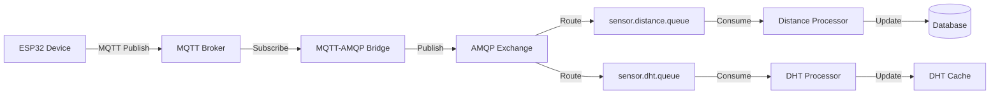
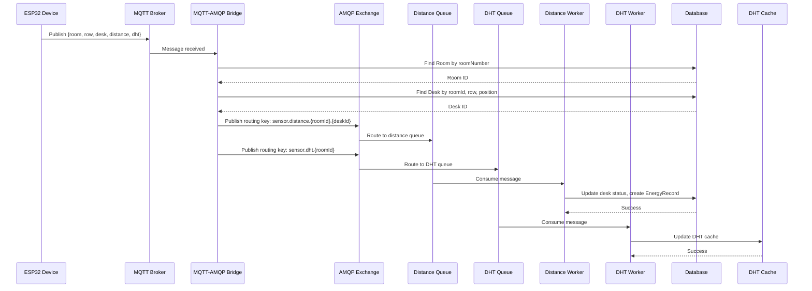

<!-- eebb99b7-3655-4f07-96c9-20bfe5bafaea 6f799084-c99c-4048-8213-71edcd5dece4 -->
# Kế hoạch: Hỗ trợ nhiều ESP32 Desks với Dynamic Desk Mapping

## Vấn đề hiện tại

Hệ thống hiện tại hardcode chỉ xử lý desk với `roomId: 1, row: 1, position: 1`. ESP32 gửi data với format:

```json
{
  "room": 1,
  "row": 1, 
  "desk": 1,
  "duration": 1000,
  "distance": {...},
  "dht": {...}
}
```

Cần parse các field này để tìm desk tương ứng trong database.

## Kiến trúc hiện tại



## Thay đổi cần thiết

### 1. MQTT-AMQP Bridge (`backend/src/services/mqtt-amqp-bridge.js`)

**Vấn đề**: Function `forwardSensorDataToAmqp()` hardcode tìm desk với `roomId: 1, row: 1, position: 1`.

**Giải pháp**:

- Parse `room`, `row`, `desk` từ ESP32 message
- Tìm `StudyRoom` với `roomNumber = data.room`
- Tìm `Desk` với `roomId = room.id, row = data.row, position = data.desk`
- Nếu không tìm thấy, log error và skip message
- Forward message với `roomId` và `deskId` đúng

**Code changes**:

```javascript
// Thay vì:
const desk = await prisma.desk.findFirst({
  where: { roomId: 1, row: 1, position: 1 }
})

// Sửa thành:
const room = await prisma.studyRoom.findFirst({
  where: { roomNumber: data.room }
})
if (!room) {
  console.error(`[Bridge] Room ${data.room} not found`)
  return
}

const desk = await prisma.desk.findFirst({
  where: {
    roomId: room.id,
    row: data.row,
    position: data.desk // ESP32 field "desk" = database "position"
  }
})
```

### 2. MQTT Client (`backend/src/services/mqtt-client.js`)

**Vấn đề**: Function `handleSensorData()` cũng hardcode tìm desk.

**Giải pháp**: Áp dụng logic tương tự như Bridge để parse và tìm desk động.

**Lưu ý**: File này có thể được deprecated nếu chỉ dùng AMQP, nhưng giữ lại để backward compatibility.

### 3. Validation và Error Handling

**Thêm validation**:

- Kiểm tra `data.room`, `data.row`, `data.desk` có tồn tại và hợp lệ
- Kiểm tra desk có `esp32DeviceId` (optional, có thể validate sau)
- Log chi tiết khi không tìm thấy desk

**Error handling**:

- Nếu không tìm thấy room/desk, log error và return (không crash)
- Có thể thêm metrics để track số lượng messages bị skip

## Luồng giao tiếp MQTT-AMQP

### Flow Diagram



### Routing Keys

- **Distance data**: `sensor.distance.{roomId}.{deskId}`
  - Example: `sensor.distance.1.5` (Room ID 1, Desk ID 5)
  - Routes to: `sensor.distance.queue`

- **DHT data**: `sensor.dht.{roomId}`
  - Example: `sensor.dht.1` (Room ID 1)
  - Routes to: `sensor.dht.queue`

- **Raw data**: `sensor.raw.{roomId}.{deskId}`
  - Backup tất cả data để audit

### Message Format

**ESP32 → MQTT**:

```json
{
  "room": 1,        // roomNumber (1-5)
  "row": 1,         // row (1-4)
  "desk": 1,        // position (1-5)
  "duration": 1000,
  "distance": {
    "data": [25.5, 26.0, 24.8]
  },
  "dht": {
    "temperature": [22.5, 22.6],
    "humidity": [65.0, 65.2]
  },
  "meta": {
    "distanceCm": 30
  }
}
```

**Bridge → AMQP**:

```json
{
  "type": "distance",
  "roomId": 1,      // Database room ID
  "deskId": 5,      // Database desk ID
  "data": {...},
  "meta": {...},
  "timestamp": "2025-01-03T12:00:00.000Z"
}
```

## Files cần sửa

1. `backend/src/services/mqtt-amqp-bridge.js`

   - Function `forwardSensorDataToAmqp()`: Parse room/row/desk và tìm desk động
   - Function `forwardConfigToAmqp()`: Tương tự nếu config có room/row/desk

2. `backend/src/services/mqtt-client.js` (optional, backward compatibility)

   - Function `handleSensorData()`: Parse room/row/desk và tìm desk động

## Testing

1. Test với ESP32 message có `room: 1, row: 1, desk: 1` (desk hiện tại)
2. Test với ESP32 message có `room: 2, row: 3, desk: 4` (desk mới)
3. Test với invalid room/row/desk (phải log error và skip)
4. Test với desk không có ESP32 (phải xử lý bình thường)

## Lưu ý

- Field `desk` trong ESP32 message = `position` trong database
- Field `room` trong ESP32 message = `roomNumber` trong database (1-5), cần map sang `roomId`
- Có thể thêm validation `esp32DeviceId` sau nếu cần security
- Hệ thống hiện tại đã hỗ trợ nhiều desks, chỉ cần sửa logic tìm desk

### To-dos

- [ ] Tạo Prisma schema với đầy đủ models (StudyRoom, Desk, SensorReading, DHT, EnergyRecord, ESP32Config, User)
- [ ] Tạo backend structure (controllers, routes, services, middlewares, index.js)
- [ ] Tích hợp MQTT service để nhận dữ liệu từ ESP32
- [ ] Tạo mock data service cho các bàn không có ESP32
- [ ] Tạo frontend với React, Vite, TailwindCSS (User và Admin dashboard)
- [ ] Tạo seed script với user và admin accounts
- [ ] Tạo các file config (.env.example, package.json, etc.)